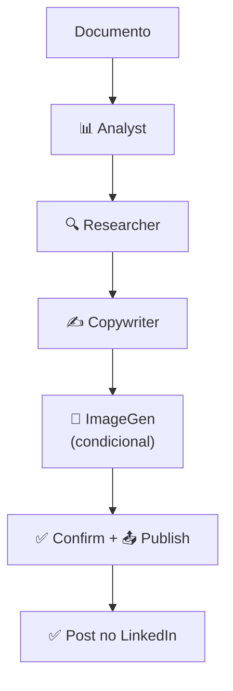

# LinkedIn Content Agent

[](https://www.python.org/downloads/)
[](https://github.com/google/adk-python)
[](LICENSE)

Sistema Multi-Agentes para transformar documentos técnicos em posts de alta performance para LinkedIn, com geração de imagem opcional, confirmação prévia e publicação automática.


## Índice

- [Sobre o Projeto](#-sobre-o-projeto)
- [Arquitetura](#-arquitetura)
- [Tecnologias](#-tecnologias)
- [Instalação](#-instalação)
- [Configuração](#-configuração)
- [Uso](#-uso)
- [Estrutura do Projeto](#-estrutura-do-projeto)
- [Agentes](#-agentes)
- [Ferramentas](#-ferramentas)
- [Licença](#-licença)

## Sobre o Projeto

O **LinkedIn Content Agent** automatiza o workflow de criação de conteúdo para LinkedIn através de um pipeline de 5 agentes especializados:

1. **Análise** de documentos técnicos (Markdown/PDF)
2. **Pesquisa** de tendências e notícias relacionadas via DuckDuckGo
3. **Redação** de post otimizado para o algoritmo do LinkedIn
4. **Geração** de imagem profissional (opcional) com OpenAI GPT-4.1-mini
5. **Confirmação** e **Publicação** via API oficial do LinkedIn

### Features

- Suporte a Markdown e PDF como input
- Enriquecimento com contexto real-time via DuckDuckGo
- Copywriting otimizado para engajamento no LinkedIn
- **Geração condicional de imagens** - escolha se quer ou não imagem
- **Confirmação via terminal** antes de publicar
- Publicação automática via LinkedIn API
- Otimização de custos com modelos diferenciados

## Arquitetura



O sistema utiliza o padrão **SequentialAgent** do Google ADK, onde cada agente:
- Executa sua tarefa específica
- Escreve o resultado em uma chave de estado (`output_key`)
- Passa o controle para o próximo agente da sequência

## 🛠️ Tecnologias

| Tecnologia | Uso |
|------------|-----|
| [Google ADK](https://github.com/google/adk-python) | Framework de agentes |
| [LiteLLM](https://github.com/BerriAI/litellm) | Proxy unificado para LLMs |
| [OpenAI GPT-4.1-nano](https://openai.com) | Análise, pesquisa, geração de imagem, publicação |
| [OpenAI GPT-4.1-mini](https://openai.com) | Geração de imagens |
| [Anthropic Claude 3.5](https://anthropic.com) | Redação de conteúdo premium |
| [LangChain + DuckDuckGo](https://python.langchain.com/) | Busca de tendências e notícias |
| [LinkedIn API](https://developer.linkedin.com) | Publicação automática |

## Instalação

### Pré-requisitos

- Python 3.10 ou superior
- Conta com créditos em OpenAI e Anthropic
- (Opcional) Aplicativo registrado no LinkedIn Developer Portal

### Passos

```bash
# Clone o repositório
git clone https://github.com/augustolnb/adk-linkedin-post-agent.git
cd adk-linkedin-post-agent

# Crie um ambiente virtual
python -m venv .venv
source .venv/bin/activate  # Linux/Mac
# .venv\Scripts\activate   # Windows

# Instale as dependências
pip install -r requirements.txt
```

## Configuração

### 1. Variáveis de Ambiente

Crie um arquivo `.env` na pasta `adk-linkedin-post-agent/`:

```env
# LLMs
OPENAI_API_KEY=sk-...
ANTHROPIC_API_KEY=sk-ant-...

# LinkedIn API (opcional - apenas para publicação)
LINKEDIN_ACCESS_TOKEN=AQV...
LINKEDIN_PERSON_URN=urn:li:person:abc123
```

### 2. LinkedIn API

Para obter as credenciais do LinkedIn, siga o tutorial:
- [TUTORIAL_LINKEDIN_API.md](./TUTORIAL_LINKEDIN_API.md)

## Uso

### Via Script de Teste (Recomendado)

```bash
cd diretorio_do_projeto/
python test_agent.py
```

O script solicita um prompt interativo no terminal.

### Via ADK Web

```bash
cd diretorio_do_projeto/
adk web
```

Acesse `http://localhost:8000` e interaja com o agente via chat.

### Exemplos de Prompts

| Prompt | Comportamento |
|--------|---------------|
| `Leia o arquivo README.md e crie um post para LinkedIn` | Gera post COM imagem |
| `Crie um post sem imagem sobre sistemas multi-agentes` | Gera post SEM imagem |
| `Transforme minha nota sobre Kubernetes em post` | Post COM imagem (default) |

### Fluxo de Confirmação

Antes de publicar, o sistema exibe:

```
======================================================================
📋 REVISÃO DO POST ANTES DA PUBLICAÇÃO
======================================================================

📝 CONTEÚDO DO POST:
--------------------------------------------------
[Texto do post gerado]
--------------------------------------------------

🖼️  IMAGEM: /caminho/para/imagem.png

======================================================================

🤔 Deseja publicar este post? (s/n/editar):
```

Opções:
- `s` - Aprovar e publicar
- `n` - Rejeitar (com feedback opcional)
- `editar` - Solicitar alterações

## Estrutura do Projeto

```
├── agent.py                 # Teste do sistema via terminal
LinkedInContentAgent/
├── __init__.py              # Exporta root_agent
├── agent.py                 # Agente raiz (SequentialAgent)
├── .env                     # Variáveis de ambiente
│
├── subagents/               # Sub-agentes especializados
│   ├── AnalystAgent/        # Analisa documentos
│   ├── ResearcherAgent/     # Pesquisa tópicos atuais sobre o tema
│   ├── CopywriterAgent/     # Redige o post
│   ├── ImageGeneratorAgent/ # Gera imagem (opcional)
│   └── PublisherAgent/      # Confirma e publica no LinkedIn
│
└── tools/                   # Ferramentas dos agentes
    ├── document_reader.py   # Leitura de MD/PDF
    ├── web_search.py        # Busca na web (DuckDuckGo)
    ├── image_generation.py  # Geração de imagem (OpenAI)
    ├── confirmation.py      # Confirmação via terminal
    └── linkedin_publisher.py # Publicação no LinkedIn
```

## Agentes

| Agente | Modelo | Função | Output Key |
|--------|--------|--------|------------|
| **AnalystAgent** | GPT-4.1-nano | Analisa documento, extrai insights e decide se gera imagem | `analyst_briefing` |
| **ResearcherAgent** | GPT-4.1-nano | Pesquisa tendências via DuckDuckGo | `research_context` |
| **CopywriterAgent** | Claude 3.5 Sonnet | Redige post otimizado | `linkedin_post` |
| **ImageGeneratorAgent** | GPT-4.1-mini | Gera imagem (se solicitado) | `image_url` |
| **PublisherAgent** | GPT-4.1-nano | Confirma com usuário e publica | `publish_result` |

### Estratégia de Custos

O sistema usa modelos de **baixo custo** (GPT-4.1-nano) para a maioria das tarefas, reservando o modelo **premium** (Claude 3.5 Sonnet) apenas para o Copywriter, onde a qualidade de escrita é crítica.

## Ferramentas

| Ferramenta | Descrição |
|------------|-----------|
| `read_markdown_file` | Lê arquivos .md |
| `read_pdf_file` | Extrai texto de PDFs |
| `scan_obsidian_vault` | Lista arquivos de um Vault |
| `adk_duckduckgo_tool` | Busca web via DuckDuckGo |
| `generate_image` | Gera imagem via OpenAI GPT-4.1-mini |
| `confirm_post` | Exibe post e pede confirmação no terminal |
| `publish_to_linkedin` | Publica via LinkedIn API |

## Documentação Adicional

- [Memorial Técnico](./MEMORIAL_TECNICO.md) - Descrição técnica detalhada
- [Diagrama de Agentes](./diagrama_agentes.md) - Visualização da arquitetura
- [Tutorial LinkedIn API](./TUTORIAL_LINKEDIN_API.md) - Configuração da API
- [Tutorial Observabilidade](./TUTORIAL_OBSERVABILIDADE_AVALIACAO.md) - Métricas e avaliação

## Licença

Este projeto está sob a licença MIT. Veja o arquivo [LICENSE](LICENSE) para mais detalhes.

---

<p align="center">
  Desenvolvido como material didático para estudo de sistemas multi-agentes com Google ADK
</p>
