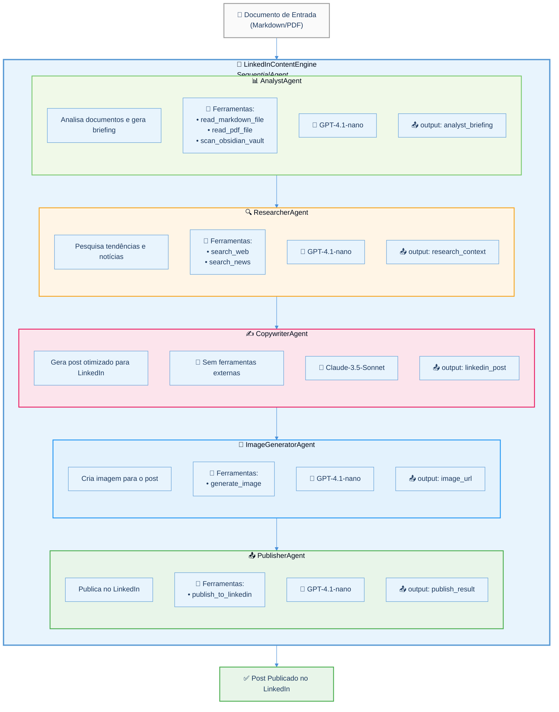
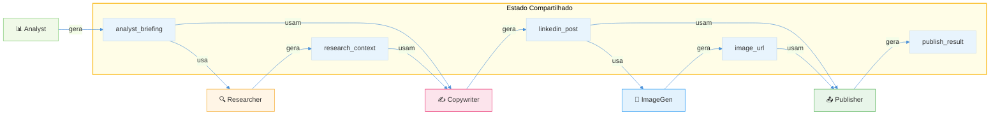

# Diagrama do Sistema Multi-Agentes - LinkedIn Content Engine

Este diagrama representa a arquitetura do sistema multi-agentes para geração de conteúdo no LinkedIn.

## Arquitetura do Pipeline

---

## Legenda dos Agentes

| Agente | Função | Ferramentas | Modelo |
|--------|--------|-------------|--------|
| **📊 AnalystAgent** | Lê documentos técnicos e extrai insights principais, gerando um briefing estruturado com tipo de post, palavras-chave e resumo otimizado | `read_markdown_file`, `read_pdf_file`, `scan_obsidian_vault` | GPT-4.1-nano (custo baixo) |
| **🔍 ResearcherAgent** | Busca contexto real-time relacionado ao tema, incluindo tendências, notícias recentes e dados relevantes | `search_web`, `search_news` | GPT-4.1-nano (custo baixo) |
| **✍️ CopywriterAgent** | Redige o post final aplicando técnicas de copywriting para LinkedIn (hook, storytelling, CTA técnico) | Nenhuma (LLM puro) | Claude-3.5-Sonnet (alta qualidade) |
| **🎨 ImageGeneratorAgent** | Gera uma imagem minimalista e profissional para acompanhar o post | `generate_image` | GPT-4.1-nano + Gemini 2.0 Flash |
| **📤 PublisherAgent** | Publica o post e a imagem diretamente no LinkedIn via API oficial | `publish_to_linkedin` | GPT-4.1-nano (custo baixo) |

---

## Legenda das Ferramentas

| Ferramenta | Descrição | Usada por |
|------------|-----------|-----------|
| `read_markdown_file` | Lê arquivos Markdown (.md) e extrai conteúdo | AnalystAgent |
| `read_pdf_file` | Lê arquivos PDF e extrai texto | AnalystAgent |
| `scan_obsidian_vault` | Lista arquivos de um Vault do Obsidian | AnalystAgent |
| `search_web` | Realiza buscas gerais na web para contexto | ResearcherAgent |
| `search_news` | Busca notícias recentes sobre o tema | ResearcherAgent |
| `generate_image` | Gera imagens usando Gemini 2.0 Flash | ImageGeneratorAgent |
| `publish_to_linkedin` | Publica posts na API oficial do LinkedIn | PublisherAgent |

---

## Fluxo de Dados

---

## Notas Técnicas

- **Tipo de Orquestração**: `SequentialAgent` - executa os agentes em sequência fixa
- **Economia de Tokens**: Usamos GPT-4.1-nano (modelo barato) para a maioria das tarefas e Claude-3.5-Sonnet (modelo premium) apenas para o Copywriter
- **Estado Compartilhado**: Cada agente escreve seu output em uma chave específica (`output_key`) que fica disponível para os próximos agentes via template `{nome_da_chave}`
